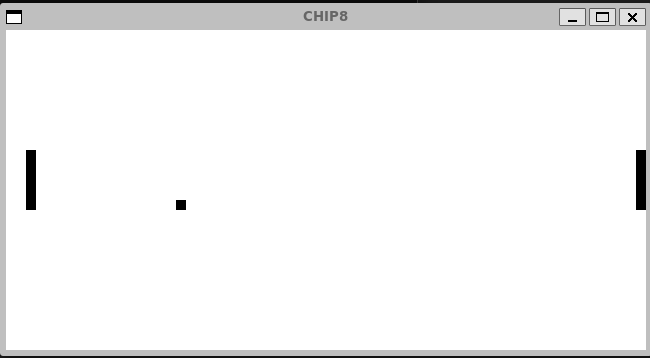

# Chip-8 Emulator

## Introduction

## What is CHIP-8?
CHIP-8 is a simple, interpreted programming language primarily used to design and run games on a variety of platforms. It was originally developed in the mid-1970s to make programming games easier for early microcomputers. The CHIP-8 system includes an instruction set and a virtual machine that enables programs written in the CHIP-8 language to be executed on compatible systems.

This is a Chip-8 emulator developed in C++ for running retro Chip-8 games. The emulator accurately emulates the behavior of the original Chip-8 system, allowing enthusiasts to enjoy classic games and experiment with Chip-8 programs.

## Features

- Accurate Chip-8 opcode emulation
- Support for all standard Chip-8 instructions
- User-friendly CLI interface
- Save and load game state
- Configurable display and sound settings (Pending)
- Pause, resume, and reset functionality (Pending)

## Getting Started

### Prerequisites

- C++ Compiler (e.g., g++ or clang++)
- SDL2 installed (apt install libsdl2-dev)

### Installation

1. Clone the repository:
git clone https://github.com/jonfpersson/chip8-emulator.git

2. Build the emulator using g++:
g++ main.cpp -lSDL2 -o chip8_emulator

## Usage
Run the emulator executable with the path to a Chip-8 ROM file as the argument:

./chip8_emulator path/to/romfile

To save state, press "j"
To load state, press "k"

## Screenshots

## Contributing

Contributions are welcome! Please fork the repository and submit a pull request.

## Acknowledgements

- [Reference Chip-8 Technical Specification](https://en.wikipedia.org/wiki/CHIP-8)
